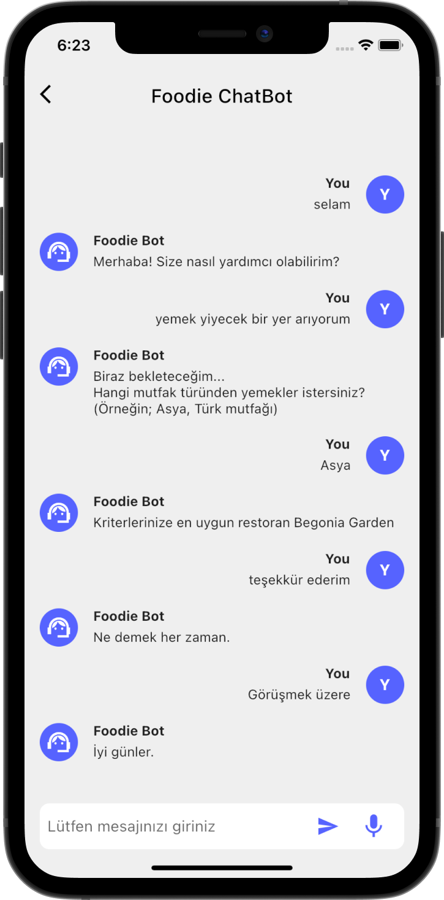

# Chatbot Flutter

Simple chatbot built using with Dialogflow and Flutter. 

You can read an article about this project, which is on medium: [https://medium.com/p/](https://medium.com/@grkmtprk99/flutter-da-dialogflow-kullanarak-chatbot-olu%C5%9Fturmak-d65166b7b445)

## Screenshots

The screenshot of the chatbot I made in another project is given below.

                                                                                                

